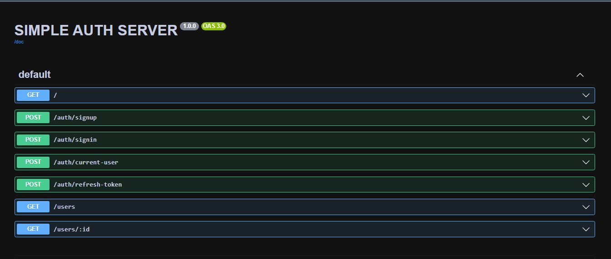

# Simple NodeJS JWT auth server

> [!NOTE]
 Rolling your own auth is highly discouraged in serious applications 

### Built with
- `Honojs + Nodejs`
  - `Honojs OpenAPI`
  - `Honojs zod-openapi`
  - `Honojs jwt`
- Drizzle ORM + SQlite
- `Vitest` 

### Thoughts
- Why Honojs and not express?
  - Its simple and easy to use , relies on web standards and supports multiple runtimes while having almost similar API

- Why `zod-openapi`?
  - it's an easy win , define your routes using their syntax and you get `openapi` validation + documentation + `swaggerUI` for free
- Why `JWT` tokens for auth ?
   - [balanced take on sessions vs tokens](https://www.youtube.com/watch?v=dgg1dvs0Bn4) 

- What about XSS ?
    - Cross side scripting is an unfortunate thing to happen to your website , but at that point even sessions won't help you much , giving your accessTokens a 1 minute life span and storing them in memory an relying on the refreshToken in your httpOnly cookie that can only be read server-side + a good content policy that blocks requests to unknown domains will go a long way in securing you from XSS
    [Ben Awad JWT safety](https://www.youtube.com/watch?v=iD49_NIQ-R4)

### Routes

**SwaggerUI route `/ui`**

**Auth route `/auth`**

-  User sign-up `/auth/signup`
   providing a unique username , email and password will return a JWT accessToken and set a `httpOnly` cookie in your browser

-  User sign-in `/auth/signin`
   providing an existing username or email and password will return a JWT accessToken and set a `httpOnly` cookie in your browser    

- User sign-out `/auth/signout`
   calling this endpoint will remove the `httpOnly` cookie in your browser and the user will have to re-sign-in on future visits

- User refresh token `/auth/current-user`
  calling this endpoint with an accessToken or valid refreshToken cookie will return the user  associated with it 

- User refresh token `/auth/refresh-token`
  calling this endpoint with a valid refreshToken cookie will return a new accessToken 
  

**Users route `/users`**

- List all users `/users` , tis endpoint requires an accessToken or valid refreshToken cookie to return the users in the database

- Get a single user `/users/:id` , tis endpoint requires an accessToken or valid refreshToken cookie to return the user in the database

### Final remarks 

As a very simple server it is missing some key features required in a proper authentication system like forgot password, remember me, multi-factor authentication, etc. 

The tests could also go a little deeper and test everything including the token generation process and DB actions

Kindly resort to a more robust solution if you need to do more than that.

### helpful resources

- [`Honojs` homepage](https://hono.dev/)
- [`Honojs` repository](https://github.com/honojs/hono)
- [official  `honojs` blog example](https://github.com/honojs/examples/tree/main/blog)
- [Drizzle homepage](https://orm.drizzle.team/)
- [Vitest homepage](https://vitest.dev)
- [Ben Awad JWT safety](https://www.youtube.com/watch?v=iD49_NIQ-R4)
- [balanced take on sessions vs tokens](https://www.youtube.com/watch?v=dgg1dvs0Bn4) 
